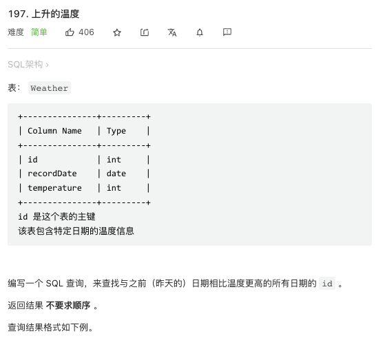

# SQL函数

## 非聚合函数

+ 

## 聚合函数

+ 计算函数

MAX() 函数返回指定列的最大值。

```mysql
SELECT MAX(column_name) FROM table_name;
```

---

+ 日期函数


对于日期类型，直接加减对于特殊情况会出错（例如2月只有28天)

```GETDATE()``` 当前的系统日期。

```mysql
select GETDATE()  --结果：2019-05-07 18:34:27.343
```


DATEADD(日期部分,number,date) 返回带有指定数字(number)的日期(date),该数字添加到指定的日期部分(datepart)

```mysql
select DATEADD(dd, 5, getdate())  --增加5天时间
```


DATEDIFF(日期部分,date1,date2) 返回两个日期中指定的日期部分之间的差值。

```mysql
select DATEDIFF(mm, '2010-1-1', '2010-3-1 00:00:00')  --结果：2
```


DATENAME(日期部分,date) 返回日期中日期部分的字符串形式。

```mysql
select DATENAME(dw,GETDATE()) --结果：星期二
```

注：DATENAME 和 DATEPART 的区别，返回的值类型不同，一个是VARCHAR一个是INT，另外就是星期会用本地语言来表示

DATEPART(日期部分,date) 返回日期中指定的日期部分的整数形式。

```mysql
select DATEPART(dw,GETDATE()) --结果(返回今天是一周中的第几天)：3
```


YEAR(date) 返回指定日期的年份数值

```mysql
select YEAR(GETDATE())  --结果：2019
```

MONTH(date)返回指定日期的月份数值

DAY(date)返回指定日期的天数值

注：当显示日期列的内容时如果只显示年月日部分,可以使用CONVERT转换函数对日期列进行转换

CONVERT(VARCHAR(10),日期字段名,120) --120 为日期格式YYYY-MM-DD

```mysql
SELECT CONVERT(VARCHAR(10),盘点日期,120) AS 盘点日期 FROM 原材料盘点日期明细表
```

-----

